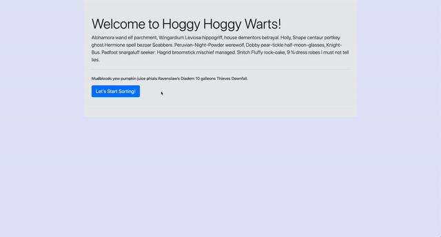

# Sorting Hat

A simple application to randomly assign students to a Hogwarts House. 

## Features

- Initial link generates a form where the user can input a student's name. 
- Form must be filled out before it can be submitted. 
- Submitting the form generates a card with the student's name and house info. 
- Each card is color coded according to the house that the student was randomly assigned.
- Each card also has an expel button that will delete the student's card. 

### Deployed via Netlify [here.](https://sorting-hat-mp.netlify.app/#)

